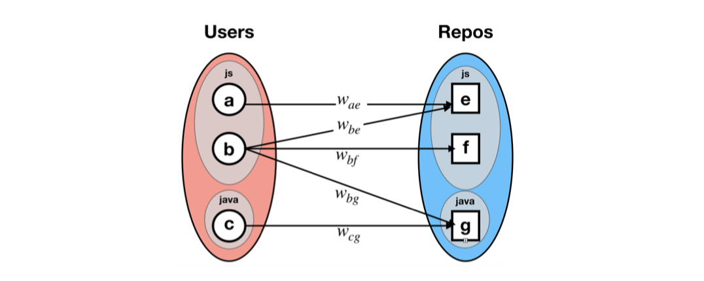
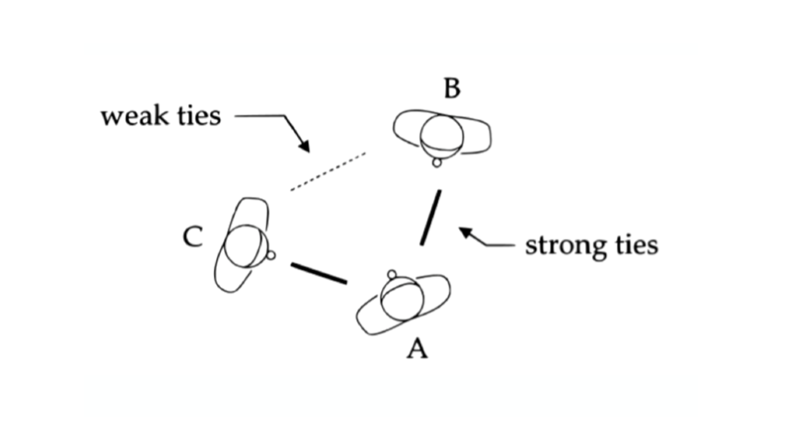
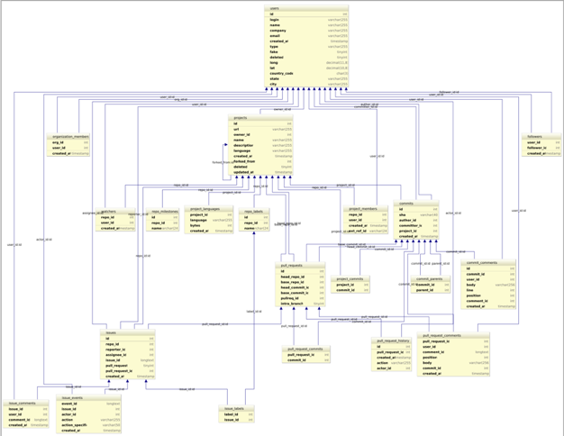
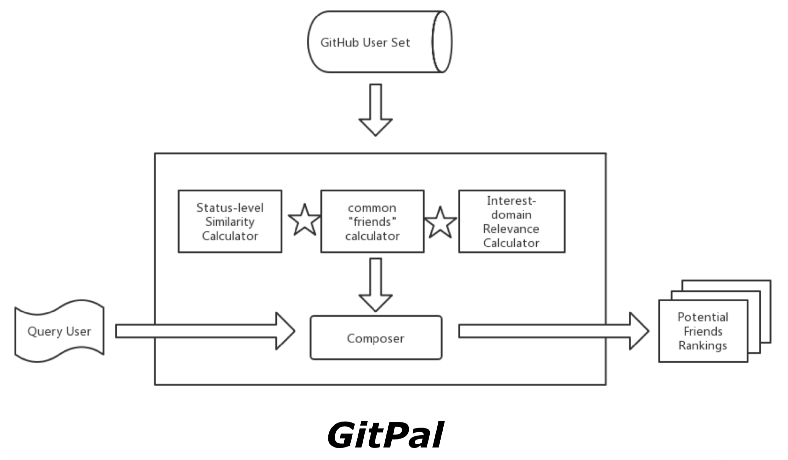
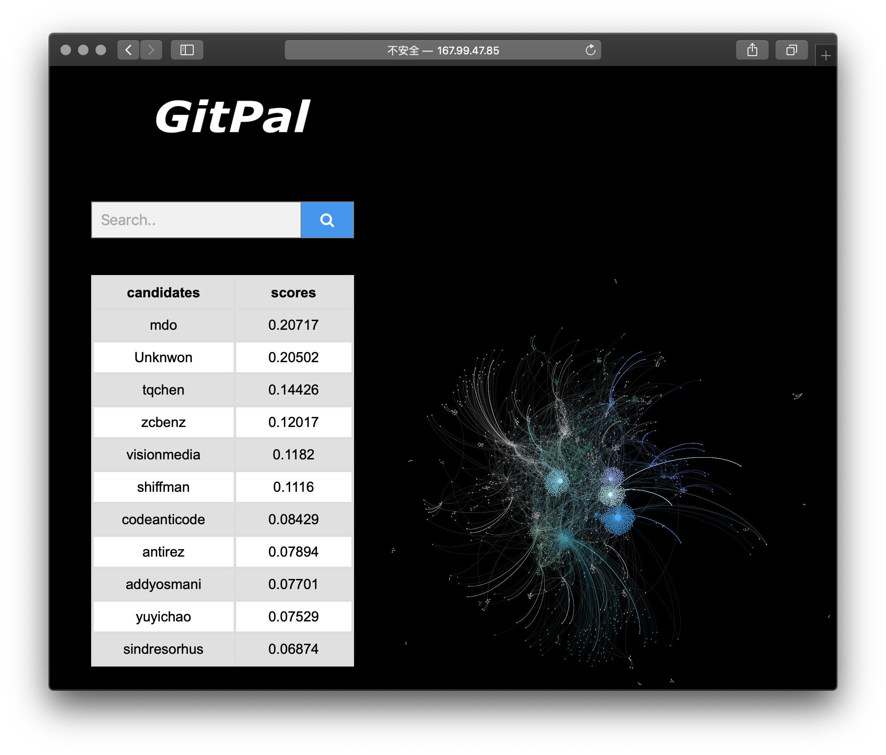

# Introduction
Social media has revolutionized how humans create knowledge artifacts. It has increased individual engagement, broadened community participation and led to the formation of new **social networks**. 
A wide variety of Web services feature publicly articulated social networks. Often, the value users derive from these services depends on the quality and diversity of users' networks. 

Friendship is a socially loaded concept often used to establish a sense of community on personal social network sites, and it has been suggested that users can benefit from connecting to new people and expanding their networks.

With the emergence of **socially-enabled** software repositories and collaborative development environments, it becomes increasingly meaningful to apply social network analysis techniques to this kind of rising field. In this project, we propose methods for :who to befriend" recommendations on `GitHub` and introduce the system we implement based on these methods.

# Background

In this section we give a brief introduction to the subject in our work, the `GitHub` site. It is a popular code repository site for a lot of well-known and active projects.

## People 
On the GitHub site, developers create profiles that can be optionally populated with identifying information including a gravatar (an image representing them throughout the site), their name, email address, organization, location, and webpage. A developer’s profile is visible to other users and displays all the repositories that person is working on and a list of their latest activities on the site.

## Code artifacts 
GitHub currently hosts over one million code repositories, and has 340,000 registered contributors. While a majority of the projects on GitHub are single-developer code dumps, many are active multi-developer projects of significant scale that have been running for some time. Each repository on GitHub has a dedicated project page that hosts the source code files, commit history, open issues, and other data associated with the project. Developers can create permanent URLs to link to specific lines within a code file. This functionality allows information about artifacts within the site to flow outside of the GitHub community to the web at large.

## Actions 
Actions in GitHub occur when a person changes an artifact or interacts with another person through the site. These actions can be code-related, communication, or subscription. Actions on code or associated with code include committing, forking and submitting a pull request. Project owners can make commits, i.e. changes to the code, by directly modifying the contents of code files. Developers without commit-rights to a project must fork a project, creating a personal copy of the code that they can change freely. They can then submit some or all of the changes to the original project by issuing a pull request. The project owner or another member with commit rights can then merge in their changes. Developers can also communicate around code-related actions by submitting a comment on a commit, an issue, or a pull request.

# Motivation
It is of great importance to practice friends identification or determination on GitHub for both technical and social reasons.

###### Technical
Discovering friend relations in GitHub can help improve collaboration efficiency. It is useful to identify the friendships which have already exist in realistic so that project managers in practice can reassign developers by taking friend relation into consideration.

###### Social
The friend determination functionality can serve as the extension of the social functionality of GitHub. On one side, it can help developers maintain and enhance relationships which have already been established. On the other hand, the functionality can help to recommend friends, construct friendships based on the extracted data on GitHub, so that developers can build brand new friendships based on the platform, which can undoubtedly improve their enjoyment not only at work but also from the user-experience point of view.

Social network services are acutely aware that users need friends to enjoy a social network, and so services like Facebook often recommend users to people.

GitHub, as an open source software (OSS) development community, is specially featured as a volunteer-driven task community, where developers’ enjoyment play a dominant role in developers’ participants.

**However, to our knowledge, there is no friend determination or friend recommendation system specially designed for GitHub, or other online software development communities**. Therefore, we propose our idea, and construct the friend recommendation system, named GitPal 3 , using the principles in follower recommendations as well as friend determination on other social platforms. We hope to put our system into realistic use, thus improving both the developing efficiency and user experience on GitHub.

# Referenced Methods
## Follower recommendation in GitHub

Following/follower recommendations can be performed according to different strategies. It is common to divide them into three categories: *behavioral*, *similarity*, and *network*.

## Similarity

In real life, people tend to befriend those with similar sociodemographic characteristics and interests, a phenomenon called homophily. It stands to reason, then, that users might be interested in attending to people with similar interests. As a proxy for this, we use user-defined “person tags”, which list users’ interests, hobbies, and skills.

## Behavioral

This recommendation type is based on already observed interaction between two people. For example, a person may have commented on code checked in by some other person or a person may have replied to a question (e.g., usage of library, report of bug, etc.) posted by someone in a discussion forum. Thus, based on the interaction between two people a follow recommendation can be made.

## Network
The network based recommendation type can be based on various techniques. Collaborative filtering is a technique for recommending content to users based on other users with similar interest. Collaborative filtering techniques are commonly seen on e-commerce sites. Applied to our problem domain, if A watches the same software repositories as B, than A might be interested in following B because both share similar interests. Triadic closure is another concept for network based recommendation. Suppose three community members A, B, and C and social ties between A–C and B–C. As suggested by Granovetter, in most of these social structures, a triadic closure occurs such that A and B are likely to become friends (or connected to each other) the more they associate with C. Network centrality of various types of vertices in a graph can be computed to determine the relative importance of vertices (e.g., methods such as `PageRank` and `HITS`). In social networks, network centrality techniques can be used to estimate the importance of users. The application is, for example, expert recommendation.

## Friend recommendation in other social platforms
**Reciprocity** is the concept in directed social networks that two actors are mutually connected to each other [7].

Typically the friend recommendation in social network services like Facebook is done by looking for people who are connected to many of a user’s friends, reasoning that the user is likely to already know them. This intuition works well in an undirected social network. However, in a directed social network setting where both social and information relationships are found, the question of who to recommend a user to follow becomes more complicated.

Furthermore, many social network services have access to much more information than the network structure: users supply details about their interests and background, and they provide clues about who interests them by choosing whose posts to read and respond to. This led us to ask what cues in a user’s profile, behavior, and network might be most effective in recommending people.

Considering all these difficulties, we include 4 more general heuristics to make our recommendations more applicable to GitHub.

# Heuristics
## Heuristic 1: People with similar interest domains are likely to be friends.
In real life, people tend to befriend others with similar characteristics and interests, a phenomenon called homophily. This give us heuristics to build a personal tag for each user based on their activities in different repositories and calculate their relevance for the subsequent friend recommendations.
### Data extraction 
In our project, interest is defined as the number of user activities in repositories of this domain. The types of activities in our data sets are shown in Figure 8 (watch, mentioned, subscribed, referenced, closed, etc.).

### Network models
Based on the extracted data, we construct the `User-Repo Network` where edges are the user's activities in the repository. It is an ordered pair $N = (V, E)$ where:

$$ E := \begin{cases}(p, q) \in P_2 (V)~|~p~has~code~activities~in~q~\end{cases}$$

We associate a weight to each edge of the network, which corresponds to the times of activities in the repository. The user-repo network is actually an information network rather than a social network since it reveals the global information of the interaction between users and repositories. 

Then we construct the `User-Domain network`, which is a network in which each node is a developer or a specific domain, and two nodes are connected if the the developer has activities in the domain. We associate a weight to each edge of the network, which corresponds to the times of activities in the domain. This is realized by relating each repository to several separate Domains based on the main programming language information of the repositories. We map the User-Repo Network to User-Domain Network based on the relations.

### Data Processing
For the query user, we find out his/her top 10 interest domains. For each candidate user in the list, we calculate their interest similarity by adding all the weights in each domain together and assign a different weight to each domain based on its ranking in the query user’s interest list. We calculate the average value, which is then normalized through Min-Max approach to the range of $[0, 1]$.

## Heuristic 2: People with similar status levels are likely to be friends.

As similarity, which depicts a user’s social characteristic, is found to be one of the most important categories in establishing friendship, we argue that similarity in social status can improve the possibilities for two users to be friends.

Here we follow a social network analysis approach that is based on well established techniques including `HITS` and `PageRank`.

Introduced by Page and Brin, the PageRank algorithm for weighting web pages importance based on their links has gained popularity driven by its use in the Google search engine. The PageRank score of a web page p at iteration i can be computed by the following equation:

$$PR(p,i) = \frac{1-r}{T}+r\sum_{q\in K_p}\frac{PR(q,i-1)}{|L_q|}$$

In this equation, r represents the probability that a web surfer would continue to surf (a.k.a. the damping factor), $T$ is the number of web pages in the database of the search engine, $K_p$ is the set of web pages that link to $p$, and $L_q$ is the set of web pages that $q$ links to.

Many researches in social networks also adopt Pagerank to represent the centrality of actors in the global view of the network. Here the PageRank of each user in the follower network is calculated to characterize the authority, or status level of the user.

### Network models
We construct the `Follower Network` in this part. The follower network is defined as follows: Let V be the set of all developers in the data set, then the follower network N is an ordered pair $N = (V, E)$ where

$$ E := \begin{cases}(p, q) \in P_2 (V)\ | \ p\ follows\ q\end{cases}$$

To obtain relative similarity S(v; q) can be normalized to [0, 1] by dividing L(v)L(q) by the bigger pagerank value of node pair i.e,

$$ StatusSimilarity(v;q) = \frac{|L_v-L_q|}{max(L_v , L_q)} $$

<!-- Here is the follower network we construct from our data (visualized via Gephi): -->

### Heuristic 3: People of common organizations are likely to be friends.

Actually, people who are friends offline often may not follow each other on Github. For example, they are best friends offline but they follow each other. However, there does exist some clue showing they may be friends. They both belong to the ’ADAPT’ lab when they are in SJTU.

It is often the case that people who belong to the same organization is more likely to follow each other.

Therefore, we can extract the organization data from users' profile, as the red boxes 4 shows.Then we treat the data as a list and calculate the Jaccard similarity of two users.

$$J(A,B)=\frac{|A\cap B|}{|A \cup B|}$$

As in 4 shows, the organization of Frank is [Adapt], while Bill belongs to [Adapt,INK]. So the Jaccard can be easily calculated as the formula above and get the organization score as 0.5.

### Heuristic 4: People with common friends are likely to be friends.
This heuristic is based on the weak tie hypothesis: if A is linked to both B and C, then there is a greater-than-chance probability that B and C are linked to each other. 

if we consider any two randomly selected individuals, such as A and B, from the set S = A, B, C, D, E, ..., of all persons with ties to either or both of them, then, for example, if A is strongly tied to both B and C, then according to probability arguments, the B-C tie is always present. The absence of the B-C tie, in this situation, would create, according to Granovetter, what is called the forbidden triad. In other words, the B-C tie, according to this logic, is always present, whether weak or strong, given the other two strong ties. In this direction, the "weak tie hypothesis" postulates that clumps or cliques of social structure will form, being bound predominately by ”strong ties”, and that "weak ties" will function as the crucial bridge between any two densely knit clumps of close friends.

In our experiments, we only take into consideration of one hop relation and bidirectional strong ties. In other words, we only treat the relation of following each other as strong ties. Also, we don't further explore the nodes that have connections with B and C.

# GitPal system
## Data sets

We obtain all the data from [GHTorrent](http://ghtorrent.org/relational.html), which is a scalable, queryable, offline mirror of data offered through the Github REST API. The schema of the data sets is shown in Figure 6. For the similicity, we only use the data in the time period of year 2010 to year 2013. The table is queried using Mysql and we extract the information from the query result to construct the social networks, then we perform our subsequent friendship determination as well as recommendations based on the networks.

## Architecture
We perform our approaches by using social network (follower network, user-repo network, etc.) and activity data from GitHub. The architecture of our system is shown in Figure 7. As can be seen from the diagram in Figure 7, the four evaluating metrics are extracted from the data set and normalized and composed to get the evaluation results. For the similipicity, we only use multiplication to combine the scores. In the future, we plan to add more evaluating cases to design a better composing methods of the 4 metrics.

Screenshot of GitPal system is shown as follows (the social network is visualized via Gephi):
 

# Summary and Future perspectives
In this project, we propose methods for "who to befriend" recommendations on GitHub and introduce the system we implement based on these methods. Our approach is based on social network analysis techniques and four heuristics are included to make the result more targeted at the online software development communities. Although it is specially designed for GitHub, the methods may be applied to other software communities and other types of social networks as well.

From this course project, we learned and accomplished the procedure to build a complete and practical system. We obtained the insight that big data in social information is important not only in analysis but also in real-world applications.

This is a preliminary work and we still have a lot to improve in the future. In our future work, we plan to enhance our system from the following aspects:

- Include larger data-sets to make our system more general;

- Consider forbidden triad in evaluating common friends;

- Optimize the performance of detection algorithm to meet online real-time demands;

- Improve the composer of our system to make the results more sensible;

- Find some ground-truth cases of friendships in GitHub to evaluate the accuracy of our results.

In the future, it is expected to see that our implementation will be integrated into GitHub, to improve recommendations of potential collaborators. 

