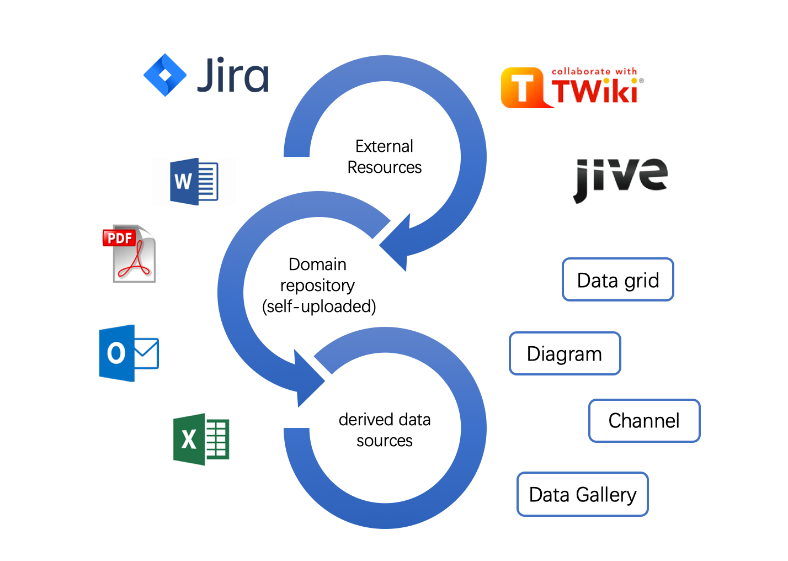

Skills: Java, Angular, ElasticSearch, TypeScript, IBM Db2

## Background: What is Prophet?

Prophet is a knowledge portal that collects resources from various sources of multiple formats within the firm.

It also makes knowledge indexed and connected, to facilitate future ad hoc tasks, new hire training, NPA analysis, etc.

Its target user is **all employees** within the firm. 

## Functionalities
### Serach and Upload the Knowledge

> Imagine you are an employee working on a new project, you may turn to many data sources for references...

#### Current Problems 
- Information is scattered everywhere. You will have to repeatedly type in keywords at each source. 
- Online materials are not enough/available. 
- In daily work scenes, e-mails generally contain valuable information. However, they are stored **privately** at local, thus being hard to share with others.

#### Solutions:

- With Prophet, you can find everything with just one click at one place. 
- Prophet leverages a web crawler, which collects materials from sources and stores them in an integrated repository.
- Prophet provide such work flow:  
```mermaid
graph LR
id5(Crawl) --> id2(Detect)
id1(Upload) --> id2(Detect) --> id3(Parse) --> id4(Index)
```
- The *parsing* strategies are adaptive to the detected file types (supporting PDF, doc/docx, json, e-mail etc.)
- A *content management portal* is designed and implemented for Prophet, where users could search and manage resources in a **Directory** structure. 

### Share knowledge: in a centralized way

> Suppose you have obtained necessary knowledge, you may want to categorize them into several groups and start a collaboration with others based on these materials...

#### Current Problems
- No methods to cluster related documents across different data sources.
- Inconvenient to share the knowledge groups/clusters with others.

#### Solutions
- Prophet provides the interfaces to leverage *Channel*, where users can create and add any type of materials.
- Users could publish and share the channels they create to certain user groups, thus facilitating collaboration.
- Users can search and subscribe specific public channels, since all channels are indexed in ElasticSearch.

### Link domain resources: Clustering and Advise

>Suppose you have categorized and launched the collaboration successfully, you may need more knowledge that you have not noticed...

#### Current Problems
- Not able to connect heterogeneous resources together
- Hard to explore more materials based on the knowledge already collected

#### Solutions
- In Prophet, knowledge is linked together by document similarity and auto-detected relationships rather than scattered randomly. 
- User could create derived knowledge, such as Diagram, Channel, Data grid, etc. 
- Therefore, Prophet could connect relevant knowledge from one starting point. 

For example, starting from a system diagram, users can be linked to the feed data used by the system, which can be then related to the Jive documents and Jira items. The feed data can also be collected by channels and data grids, and from channels users can further access related documents and e-mails.

## Summary: What does Prophet do?

### Knowledge Gathering
Prophet gathers informaiton in various formats from scattered sources, ranging from online portals to local sources. Then it parses and indexes information to a centralized repository.

### Knowledge Linkage
Prophet establishes connection among knowledge based on auto-detected relationships as well as content similarity.

### Knowledge Sharing
Knowledge Sharing is achieved both in **distributed** and **centralized** ways. For the distributed way, user could upload local materials, which are indexed to repository thus being achievable for others. Users could also share in a centralized way, where channels are created for futher searching, subscribing and editing.

## Some use cases
1. New hire training: Enable the creation of a bunch of indexed training materials to group meaningful information (like e-mails, jira,jive, twiki and local documents) altogether in a targeted manner so that new hires can get familiar to the business in a shorter learning curve.
2. Launch a project: Developers could use channel to sync up their working progress. Project Managers and Business Analyst may need all the Jira items for the information of the requirements and progress details.

## Further Enhancements

- Enable more data sources.
- Improve similarity algorithm: Machine learning and Deep Learning models can be leveraged to evaluate the document similarity with more efficiency.
- Visualize the linkage: Complex relationships should be visualized through a graph, so that users can get an intuitive and general understanding of the knowledge they are interested in.

